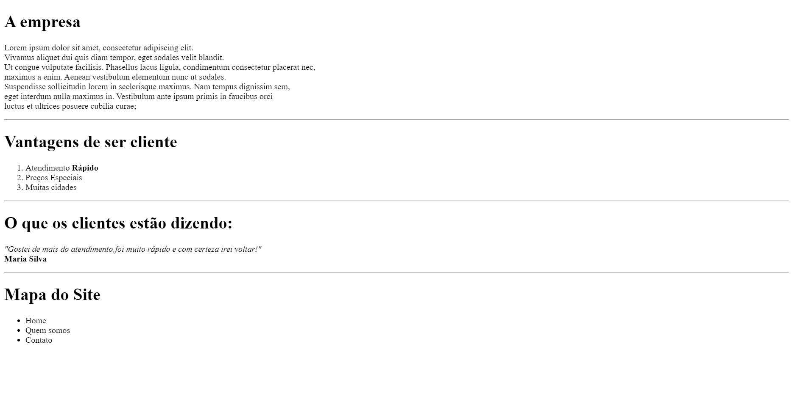

# Estruturas Básicas do HTML5

Exercicio proposto no curso da Udeny Desenvolvimento
Web completo 2022

Estruturas usadas
cabeçalhos, titulos (h), listas ordenadas e não ordenadas, enfase e negrito.

